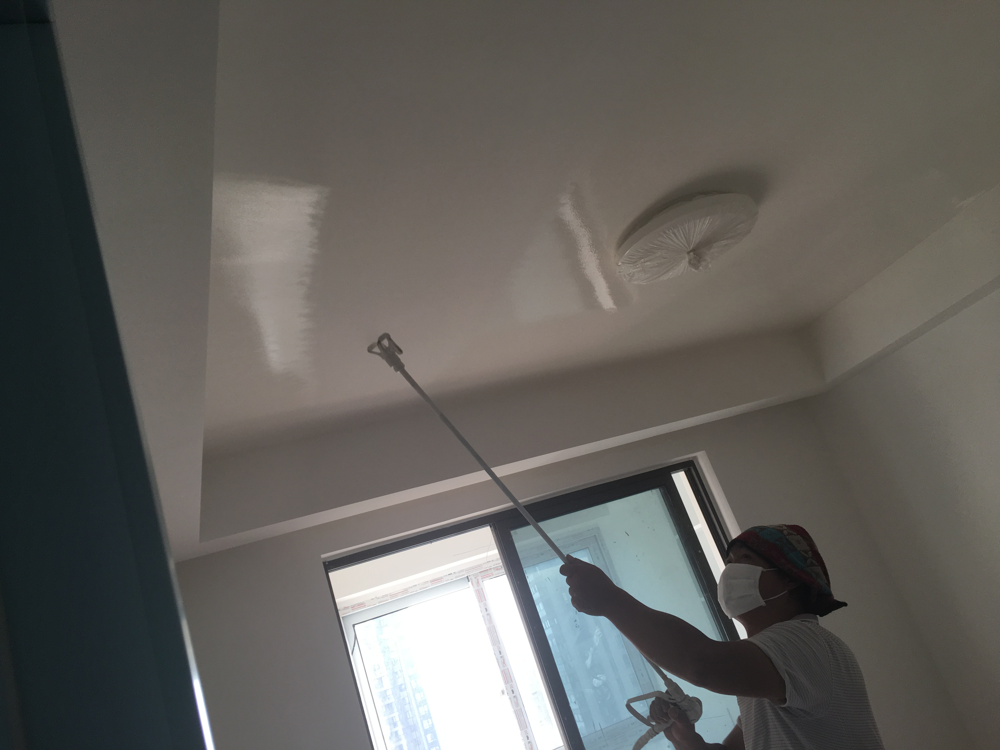

# 硅藻泥 Diatom mud

## 硅藻泥介绍

[硅藻泥](https://baike.baidu.com/item/%E7%A1%85%E8%97%BB%E6%B3%A5/10510401?fr=aladdin)（Diatom mud）是一种以[硅藻土](https://baike.baidu.com/item/%E7%A1%85%E8%97%BB%E5%9C%9F/1919094)为主要原材料的内墙环保装饰壁材。

### 品牌

[兰舍 Lanshe](http://www.lsgzn.com/)（吉林长春），据店员说是国内最好品牌，还领我去看一户人家全屋刷了他们的产品。她们还不无夸张的说人寿保险职员都刷了硅藻泥。听上去很讽刺，但也突出硅藻泥的重要性。

[兰舍一号](http://fz.quanjiamei.com.cn/news2_3549_36.html):

硅藻泥虽然能吸附甲醛，但是不能分解，吸附到一定程度也就饱和了，而且之后温度变化还可能散发出来，因此需要用兰舍一号（一种光触媒）进行分解。兰舍一号非常珍贵。

### 网络

网上也有质疑的声音，可以百度。也有高度赞美的报导，没有进一步考察真实性。

知乎上有“兰舍硅藻泥”，但是是空的没有文章。但有很多[提问](https://www.zhihu.com/search?type=content&q=%E5%85%B0%E8%88%8D%E7%A1%85%E8%97%BB%E6%B3%A5)

这个似乎更高大上，[蓝天豚](http://www.diatommud.com/)，英文主页应该是出口国外了。

下面这段话让人喷饭，也让人警惕

> 消费者被“硅藻泥”搞得丈二和尚摸不着头脑！不信你到市场上走一圈，你准会被各种五花八门的说辞搞懵了。先来到兰舍硅藻泥店面，店面的人说：我们兰舍硅藻泥靠添加“兰舍一号”分解甲醛。客户问：“兰舍一号”是什么东西啊？店里回答：是宝石级的碧玺。再到大津硅藻泥店面，店面的人说：我们大津硅藻泥靠添加“高分子”分解甲醛。客户问：“高分子”是什么东西啊？店里回答：是高科技分子。第三家到了绿森林硅藻泥店面，店面的人说：我们绿森林靠光触媒分解甲醛。客户问：光触媒是个什么东西啊?店里回答：是纳米二氧化钛。如果继续走下去，你肯定还会听到更多五花八门的说词，什么“靠第三代弱碱性分解甲醛”，什么“最新一代白炭黑硅藻泥”等等。

*注* [碧玺Tourmaline](https://en.wikipedia.org/wiki/Tourmaline)

### 作用

* 吸收甲醛等污染气体
* 可代替乳胶漆

### 装修

一共刷几遍，每次爽完干了以后再刷第二遍，喷涂

**注意** 刷硅藻泥之前，不要刷漆，不要让墙面太光滑，做一下打底就可以了。我的项目经理上了腻子，结果就耽误了刷硅藻泥。后来，又因为撤掉了原来的地保，再次耽搁。

建议大家在装修刷完第一遍墙（不刷乳胶漆，也不上腻子）开始刷硅藻泥。

## 市场行情

据工人说，北方有70%刷上了硅藻泥，南方相对来说少了许多。工人对国外市场的情况并不清楚，也不清楚是国外开始的还是国内开始的。

## 分公司

### 购买套餐

我找的是绍兴市柯桥区分公司。因为觉得贵了，也不知道自己是不是长期居住在柯桥，我只做了卧室。我的套餐：墙面加顶（不属于同一个套餐），一共5000元，外送一个图案（底色和图案颜色可自己挑选）。

### 谈判经历

我和他们商谈过。我的交易谈判经验不够，问的也不仔细。但是国内员工素质如何真不好说，问了几遍，也得不到充分的信息，很多技术性强的专业问题也不好意思出口，搞得自己很学院似的。我就问了一句“甲醛会分解成什么”，他们第一个反应是说“这是化学”。可这里的关键不就是化学反应吗？这样的答复我当然不敢继续问了。我估计他们连甲醛的分子式都不会写。没有化学反应，一切都是摆设。

我希望我能自由提问，尤其是专业问题。而店员也能提供有价值的信息，而不是一味强调自己的产品有多好，自己有多诚信。

目前（2018年9月19日）做了顶，明天做墙面。以后有新信息，还会修改。

